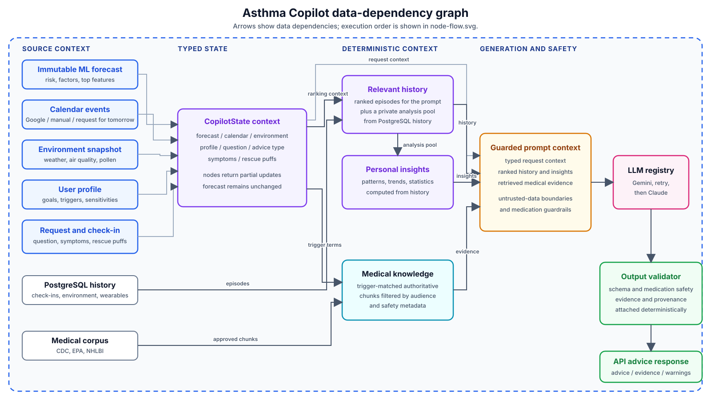
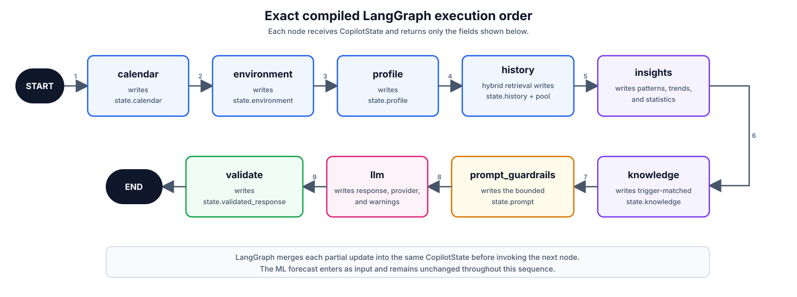

# Asthma Copilot

The Copilot turns an existing asthma flare-up forecast into grounded,
personalized, safety-checked guidance.

- The ML model predicts risk and contributing factors.
- The Copilot explains context and suggests educational next steps.
- The Copilot never recalculates or changes the forecast.
- If every LLM is unavailable, the API still returns the forecast with
  `advice: null` and a warning.

It is used by `POST /v1/forecast` and `POST /v1/advice`.

## Architecture

LangGraph coordinates a fixed sequence of nodes over one typed `CopilotState`.
LangChain provides a shared interface for Gemini and Claude.



The diagram shows data dependencies, not execution order. Providers collect
context; they do not call the LLM. The LLM does not query the database or run
the prediction model.



Each node returns only its state updates. LangGraph merges those updates before
running the next node.

## Workflow

1. Receive an immutable forecast and request context.
2. Load calendar, environment, and profile data.
3. Rank relevant historical episodes.
4. Compute personal patterns and trends in Python.
5. Retrieve trigger-matched medical knowledge.
6. Build a guarded prompt from the selected context.
7. Call Gemini, retry, then fall back to Claude.
8. Validate schema, medication safety, evidence, and provenance.

Only the five most relevant historical episodes enter the prompt. A larger
private pool supports deterministic insight calculations. Historical patterns
are described as associations, never causes.

## Package map

| File | Responsibility |
|------|----------------|
| `workflow.py` | Graph definition, prompt guardrails, validation, and `generate_copilot_advice()` |
| `state.py` | Typed graph state and validated API contracts |
| `providers.py` | Calendar, environment, profile, history, insights, and knowledge providers |
| `llm.py` | Gemini/Claude registry, retries, fallback, parsing |
| `ingest.py` | Builds approved knowledge chunks from `knowledge/sources.json` |
| `trace.py` | Compact development trace of each graph stage |

`workflow.py` is the best starting point for tracing a request.

## Safety boundaries

- Forecast values remain unchanged.
- Patient requests cannot retrieve clinician-only chunks.
- Advice cannot diagnose, prescribe, or change medication or dosage.
- Context JSON is treated as untrusted data, not instructions.
- Evidence references come only from retrieved chunks.
- Invalid or unsafe model output is rejected.

Every knowledge chunk records its audience, advice types, trigger tags, source
provenance, document hash, and `medication_change_allowed: false`.

## Configuration

Set these values in `.env`:

```env
GEMINI_API_KEY=...
ANTHROPIC_API_KEY=...
LLM_PROVIDER=gemini
LLM_FALLBACK_PROVIDER=claude
GEMINI_MODEL=gemini-2.5-flash
CLAUDE_MODEL=claude-3-5-haiku-latest
```

Models use temperature `0` for more deterministic output.

## Knowledge corpus

Rebuild the generated corpus from `asthma-app`:

```bash
python -m copilot.ingest
```

The allowlisted source manifest is `knowledge/sources.json`; output is written
to `knowledge/generated/chunks.json`. New remote publishers must be added to
`ALLOWED_REMOTE_HOSTS`. Local documents must stay under `knowledge/` and be
explicitly enabled in the manifest.

Retrieval is intentionally small and explainable: trigger tags have the highest
weight, headings are next, and body text is lowest. Weak matches are omitted.
`MedicalKnowledgeProvider` can later switch to BM25 or embeddings without
changing the graph contract.

## Inspecting the workflow

Start PostgreSQL and run the deterministic trace:

```bash
docker compose up -d
PYTHONPATH=. python scripts/trace_copilot_workflow.py --rows 2
```

Useful options:

```bash
PYTHONPATH=. python scripts/trace_copilot_workflow.py \
  --rows 1 \
  --prompt-chars 400

# Calls configured providers and may incur API usage
PYTHONPATH=. python scripts/trace_copilot_workflow.py --live-llm
```

The default trace uses demo data, a fake LLM, and a rolled-back database
transaction. Do not enable unrestricted prompt or state logging in production;
the context can contain personal health information.

## Testing

```bash
pytest
```

Coverage is split across:

- `test_copilot_workflow.py` — graph, fallback, outages, guardrails
- `test_copilot_providers.py` — context, insights, retrieval
- `test_copilot_trace.py` — trace formatting and truncation
- `test_knowledge_ingestion.py` — cleaning, provenance, path safety
- `test_forecast_advice_api.py` — API behavior and LLM outages

## Extension points

- Implement `CalendarProvider` for production calendar access.
- Add a LangChain-compatible factory to `LLMRegistry` for another model.
- Add an allowlisted source, re-ingest it, and inspect extraction quality.
- Replace lexical retrieval behind `MedicalKnowledgeProvider`.

## Limitations

- This is an educational assistant, not a clinician or emergency service.
- Historical associations are not causal findings.
- Environment thresholds guide retrieval; they are not diagnoses.
- Knowledge quality depends on source review and clean extraction.
- Medication changes belong in a clinician-authored asthma action plan.
